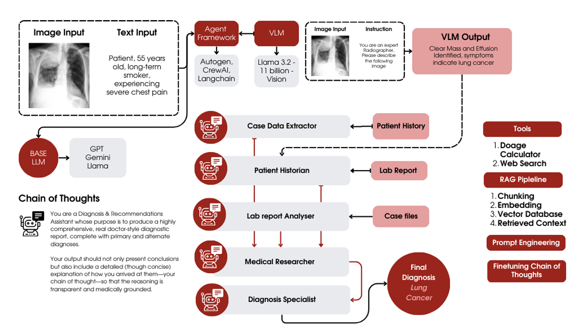
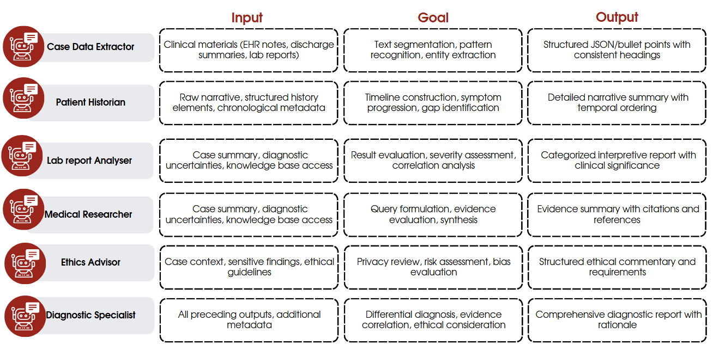
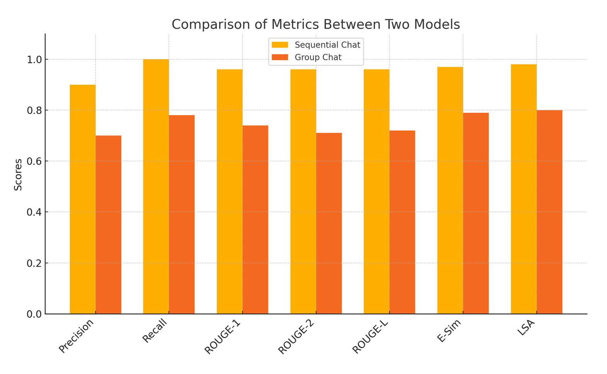
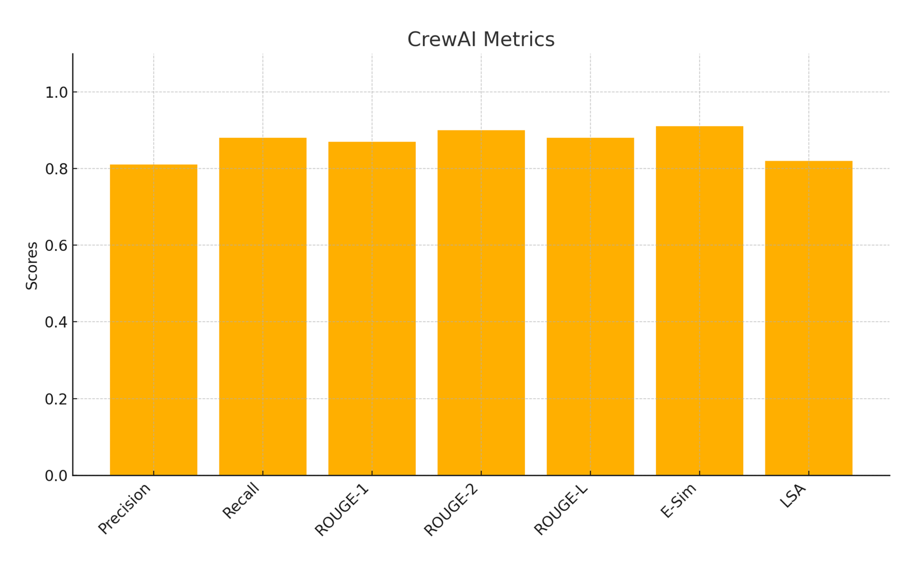

# 🏥 AI-Powered Clinical Decision Support System

## The Problem We're Solving

**Imagine this scenario**: A 65-year-old patient arrives at the emergency department with chest pain and shortness of breath. The medical team must quickly synthesize:
- Complex patient history (hypertension, diabetes, family cardiac history)
- Multiple lab results (elevated troponin I, BNP levels, abnormal lipid panel)
- Imaging findings (mild cardiomegaly, ECG abnormalities)
- Latest medical guidelines and treatment protocols
- Ethical considerations for informed consent and treatment options

**The Challenge**: In high-pressure clinical environments, healthcare providers often struggle to:
- 🔍 **Integrate disparate data sources** - Patient records, lab results, and imaging studies exist in silos
- 📚 **Stay current with medical literature** - New guidelines and treatments emerge rapidly
- ⚖️ **Balance clinical efficiency with thorough analysis** - Time constraints can compromise diagnostic accuracy
- 🤝 **Ensure ethical decision-making** - Complex cases require careful consideration of patient autonomy and consent

## Our Solution: Multi-Agent AI Clinical Team

We've built an **AI-powered clinical decision support system** that mimics a multidisciplinary medical team working together on complex cases. Think of it as having a team of specialized medical professionals collaborating in real-time:



### 🤖 Our AI Medical Team

| **Agent** | **Role** | **What They Do** |
|-----------|----------|------------------|
| 🩺 **Patient Historian** | Medical History Specialist | Analyzes patient demographics, symptoms, medical history, medications, and family history |
| 🧪 **Lab Interpreter** | Laboratory Results Expert | Interprets blood work, cardiac enzymes, lipid panels, and identifies clinical significance of abnormalities |
| 🔬 **Medical Researcher** | Clinical Research Specialist | Searches medical literature, guidelines, and latest treatments using both local knowledge base and web sources |
| ⚖️ **Ethics Advisor** | Medical Ethics Consultant | Ensures all decisions adhere to ethical principles, patient autonomy, and informed consent |
| 📊 **Case Data Extractor** | Clinical Data Organizer | Structures and prioritizes clinical findings for diagnostic consideration |
| 🎯 **Diagnostic Specialist** | Clinical Diagnostician | Synthesizes all information to provide differential diagnoses with confidence levels |

### 🔄 How It Works



1. **Sequential Analysis**: Each agent builds upon previous findings, ensuring comprehensive coverage
2. **Multi-Source Intelligence**: Combines local medical knowledge base with real-time web research
3. **Ethical Oversight**: Every decision is evaluated for ethical implications
4. **Evidence-Based Reasoning**: All conclusions are supported by medical literature and guidelines
5. **Transparent Reporting**: Each agent produces detailed reports explaining their reasoning

### 📈 Proven Results

Our evaluation shows that this **sequential multi-agent approach significantly outperforms** traditional methods:




- **Precision**: 0.90 (90% accuracy in diagnostic recommendations)
- **Recall**: 1.00 (100% coverage of relevant clinical factors)
- **Faithfulness**: Superior to group-chat baselines
- **Clinical Relevance**: Higher quality diagnostic reasoning

## 🎯 Real-World Application Example

Our system successfully analyzed a complex cardiac case:

**Patient**: 65-year-old male with chest pain and shortness of breath
- **Risk Factors**: Hypertension, Type 2 diabetes, hypercholesterolemia, family history of cardiac disease
- **Key Findings**: Elevated troponin I (0.08 ng/mL), elevated BNP (180 pg/mL), mild cardiomegaly
- **AI Analysis**: Our agents identified potential cardiac distress, recommended immediate diagnostic workup, and provided evidence-based treatment options
- **Ethical Considerations**: Addressed informed consent, patient autonomy, and multidisciplinary care approach

## 📁 Project Structure

```
multi-agent-clinical-support/
├── 🧠 data/knowledge_base/          # Medical knowledge repository
│   ├── medical_knowledge/           # Lab values, medication interactions, vital signs
│   ├── medical_literature/          # Clinical guidelines and practice standards
│   └── patients/                   # Case studies and exemplar cases
├── 👤 data/patient_case/           # Sample patient data
│   ├── patient_profile.txt         # Demographics, history, medications
│   ├── lab_results.txt            # Laboratory test results
│   └── imaging_results.txt        # Radiology and ECG findings
├── 🤖 src/doctor/                 # AI agent system
│   ├── config/                    # Agent roles and task definitions
│   ├── crew.py                   # Multi-agent orchestration
│   └── main.py                   # Application entry point
├── 📊 examples/outputs/           # Sample AI-generated reports
├── 📈 docs/results/              # Performance evaluation metrics
└── 🔧 Configuration files        # Dependencies and environment setup
```

## 🧪 Sample AI Outputs

Our system generates comprehensive reports for each clinical aspect:

- **📋 Patient History Analysis**: Detailed demographic and medical history review
- **🧪 Lab Interpretation**: Clinical significance of abnormal values with reference ranges
- **🔬 Medical Research**: Latest treatment guidelines and clinical evidence
- **⚖️ Ethics Assessment**: Ethical considerations and patient rights evaluation
- **🎯 Diagnostic Report**: Differential diagnoses with confidence levels and supporting evidence
- **💊 Treatment Plan**: Evidence-based recommendations with medication and follow-up protocols

## 🚀 Quick Start Guide

### Prerequisites
- Python 3.8+
- Serper API key (for web search capabilities)

### Installation
1. **Clone the repository**
   ```bash
   git clone <repo-url>
   cd multi-agent-clinical-support-main
   ```

2. **Set up environment**
   ```bash
   # Create virtual environment
   python -m venv .venv
   source .venv/bin/activate  # Windows: .venv\Scripts\activate
   
   # Install dependencies
   pip install -e .
   ```

3. **Configure API access**
   ```bash
   cp .env.example .env
   # Edit .env and add your Serper API key:
   # SERPER_API_KEY=your_api_key_here
   ```

### 🏃‍♂️ Running Your First Analysis

```bash
python -m doctor.main
```

**What happens next:**
1. 🤖 Six AI agents collaborate sequentially on the sample cardiac case
2. 📊 Each agent generates detailed reports in the `outputs/` directory
3. 📝 Terminal shows real-time progress as agents analyze patient data
4. ✅ Comprehensive diagnostic assessment completed in minutes

**Expected Output:**
- `outputs/ethics_assessment.md` - Ethical considerations and patient rights
- `outputs/condition_research.md` - Latest medical research and guidelines  
- `outputs/patient_history.md` - Comprehensive patient history analysis
- `outputs/lab_interpretation.md` - Laboratory results interpretation
- `outputs/case_data.md` - Structured clinical findings
- `outputs/diagnostic_report.md` - Differential diagnoses with confidence levels
- `outputs/treatment_plan.md` - Evidence-based treatment recommendations

## 🔬 Technical Architecture

### Multi-Agent Framework
- **CrewAI**: Orchestrates agent collaboration and task sequencing
- **Retrieval-Augmented Generation (RAG)**: Combines local medical knowledge with real-time web research
- **MDX Knowledge Base**: Structured medical literature and clinical guidelines
- **Tool Integration**: File reading, web search, and content scraping capabilities

### Key Technologies
- **Language Models**: GPT-based agents for medical reasoning
- **Knowledge Retrieval**: MDX search for medical literature access
- **Web Integration**: Serper API for real-time medical research
- **Evaluation Framework**: DeepEval for performance benchmarking

## 🎯 Future Enhancements

### Immediate Opportunities
- **🖼️ DICOM Integration**: Direct analysis of medical imaging files
- **📱 Mobile Interface**: Point-of-care clinical decision support
- **🔄 Real-time Updates**: Live integration with hospital information systems
- **🌐 Multi-language Support**: Expand to serve diverse patient populations

### Advanced Features
- **🤖 Custom Agent Training**: Specialized agents for different medical specialties
- **📊 Predictive Analytics**: Risk stratification and outcome prediction
- **🔗 EHR Integration**: Seamless connection with electronic health records
- **👥 Multi-provider Collaboration**: Support for team-based care coordination

## 👥 Development Team

**Team 2 - Major Project**  
*AI-Powered Clinical Decision Support System*

### Core Contributors
- **Ratan Ravichandran** (ENG21AM0093) - Multi-agent system architecture & implementation
- **Sayli Pankaj Bande** (ENG21AM0112) - Medical knowledge base & evaluation framework

### Academic Supervision
**Dr. Vinutha N** - Associate Professor, Computer Science & Engineering (AI & ML)

---

## 🌟 Impact & Vision

This project represents a **proof-of-concept** for the future of clinical decision support. By demonstrating how AI agents can collaborate like human medical teams, we're paving the way for:

- **⚡ Faster Diagnoses**: Reduce time-to-diagnosis in critical cases
- **🎯 Improved Accuracy**: Minimize diagnostic errors through comprehensive analysis  
- **📚 Knowledge Democratization**: Make expert-level medical reasoning accessible
- **⚖️ Ethical AI**: Ensure AI-assisted medicine maintains human values and patient rights

**The future of healthcare is collaborative - between humans and AI working together to save lives.**

---

*This project was developed as part of a major academic project, demonstrating the potential of multi-agent AI systems in clinical decision support. While not intended for clinical use, it showcases the transformative possibilities of AI in healthcare.*
